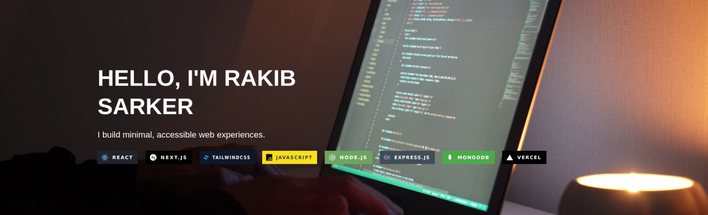

#  Hey, I'm Rakib Sarker
  
Frontend Developer 
React & Next.js Enthusiast 
Exploring Full-Stack Development (MERN)

---

---

## 💫 About Me

I'm a Frontend Developer passionate about building modern, responsive, and user-friendly web applications.

My core expertise includes React.js, Next.js, JavaScript (ES6+) and Tailwind CSS, with a strong focus on creating clean, accessible, and high-performance user interfaces. I also have practical experience with the MERN Stack (MongoDB, Express.js, React, and Node.js), enabling me to develop and collaborate on full-stack applications.

I enjoy solving real-world problems, writing clean and maintainable code, and continuously learning new technologies to improve my skills as a developer.

---

## 🛠️ Tech Stack

### Frontend

### Backend

### Tools

---

## 📊 GitHub Stats

## 🌐 Connect With Me

---

💙 Thanks for visiting my profile!

